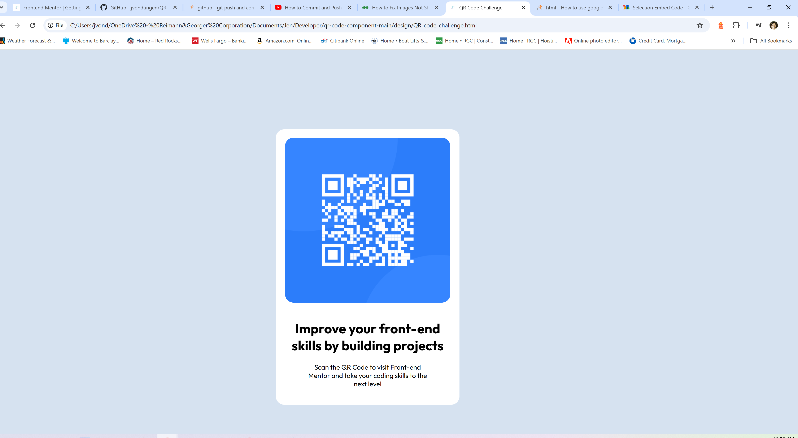

# Frontend Mentor - QR code component solution

This is a solution to the [QR code component challenge on Frontend Mentor](https://www.frontendmentor.io/challenges/qr-code-component-iux_sIO_H). Frontend Mentor challenges help you improve your coding skills by building realistic projects. 

## Table of contents

- [Overview](#overview)
  - [Screenshot](#screenshot)
  - [Links](#links)
- [My process](#my-process)
  - [Built with](#built-with)
  - [What I learned](#what-i-learned)
  - [Continued development](#continued-development)
  - [Useful resources](#useful-resources)
- [Author](#author)
- [Acknowledgments](#acknowledgments)

## Overview
This is my first Frontend Mentor challenge, the QR Code component. 

### Screenshot

![screenshot]

### Links

- Solution URL: [design/QR_code_challenge.html](https://your-solution-url.com)
- Live Site URL: [Add live site URL here](https://your-live-site-url.com)

## My process
I am just starting out and my process was not really a process at all. Guess this is why I am doing this, to learn. Started with HTML, since the tutorial suggested that. Then went on to CSS. Did not start with mobile first (my first mistake!). This part was mostly trial and error (again, not a process).

### Built with

- Semantic HTML5 markup
- CSS custom properties

### What I learned

Hmm, mostly learned how much I still have to learn! Did learn how to set up repository and push initial and updates. Also learned to start with mobile first and complete html before styling. Good first challenge, I thought it was very difficult. I had the most trouble with not knowing how to get the margins and sizes correct. Used an @media query for the mobile version, but couldn't get it to work on various sizes.

### Continued development

Getting it to be responsive was very difficult and it isn't where it should be. Will need to work on that as well as CSS in general. Too much trial and error. Think I needed to use a grid or flexbox, so will revisit that. 

### Useful resources

- [W3 Schools](https://w3schools.com) - This was a great resource for me to remember some CSS rules etc. 

## Author

- Website - [Add your name here](https://www.your-site.com)
- Frontend Mentor - [@jvondungen](https://www.frontendmentor.io/profile/jvondungen)

